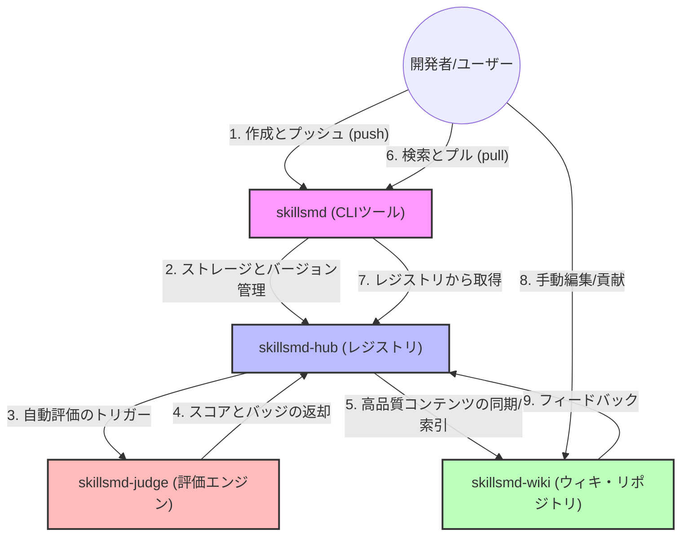

# OpenSkillsmd: AIエージェントの「進化」を再定義する

[English](./README.md) | [简体中文](./README.zh.md) | [日本語](./README.ja.md) 

OpenSkillsmdは、AIエージェントスキルのためのオープンソース・インフラです。スキルの**配布センター (Docker Hub)** であると同時に、グローバルなエージェントスキルの**百科事典 (Wikipedia)** でもあります。

---

## 🌟 ビジョン

### 📦 Dockerのような効率的な配布
標準化された `skill.md` プロトコルを通じて、スキルの `pull` と `push` を実現します。公式認定またはコミュニティによる高品質なスキルをワンクリックで取得し、エージェントの能力を即座に拡張できます。

### 📖 Wikipediaのような知識の共創
すべての `skill.md` はエージェントの知恵の結晶です。コミュニティがスキルドキュメントを継続的に更新・参照し合うことで、プロンプトやツール定義を構造化し、透明性を高めます。

### 📊 客観的な評価とスコアリング
AI駆動の自動評価システムにより、公開されたスキルを多角的（品質、安定性、適応性）に評価します。厳しい基準をクリアしたスキルのみが「公式認定」を受け、信頼性を保証します。

### 🚀 スローガン
> "高品質なスキルをダウンロードし、エージェントの未来を編集しよう。"

---

## 📂 リポジトリ構成

| リポジトリ | ロール | 説明 | ビジョン |
| :--- | :--- | :--- | :--- |
| **`skillsmd`** | **CLI** | `pull/push` などをサポートするバイナリツール。 | 生産性 |
| **`skillsmd-hub`** | **レジストリ** | バージョン管理、API、メタデータを担当するコアバックエンド。 | 配布 |
| **`skillsmd-wiki`** | **コンテンツ** | カテゴリ化された `skill.md` ライブラリ。 | 知識 |
| **`skillsmd-judge`** | **評価エンジン** | AIを活用したスコアリングおよび認証エンジン。 | 品質 |

## 🔗 動作の流れ

