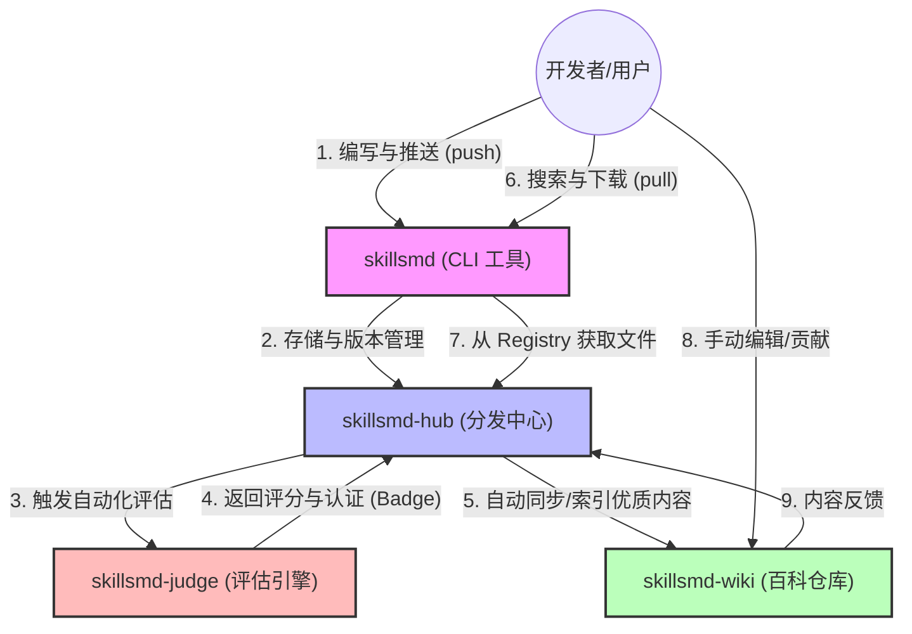

## Hi there 👋

### OpenSkillsmd: 重新定义 Agent 的“进化”方式
OpenSkillsmd 是一个面向 AI Agent 技能的开源基础设施。我们不仅是技能的分发中心 (Docker Hub)，更是全球 Agent 技能的百科全书 (Wikipedia)。

📦 像 Docker 一样高效分发 通过标准化的 skill.md 协议，实现 Agent 技能的 pull 与 push。开发者可以一键下载官方认证或社区贡献的优质技能，实现 Agent 能力的瞬时扩展与即插即用。

📖 像 Wikipedia 一样共建知识 每一条 skill.md 都是 Agent 智慧的结晶。我们鼓励社区像编辑维基百科一样，持续迭代、交叉引用并完善技能文档，让 Agent 的指令集、工具定义与边界说明变得结构化、透明化。

📊 像评测机构一样客观打分 基于 AI 驱动的自动化评估系统，我们对公开的技能进行多维度评分（指令质量、稳定性、适应性）。只有通过严格评估的技能才能获得“官方认证”，确保开发者下载的每一行代码都是生产可用的。

### 核心口号
"Pull high-quality skills, Edit the future of Agents." 

## 📂 OpenSkillsmd 仓库架构对照表

| 仓库名称 | 核心角色 | 职责描述 | 对应愿景 |
| :--- | :--- | :--- | :--- |
| **`skillsmd`** | **命令行入口 (CLI)** | 用户安装的二进制工具，支持 `skillsmd pull/push/run` 等命令。 | **生产力工具** |
| **`skillsmd-hub`** | **分发中心 (Registry)** | 核心后端服务，负责存储 Skill 版本、处理 API 请求与元数据索引。 | **Docker Hub** |
| **`skillsmd-wiki`** | **知识协作库 (Content)** | 存放按类别组织的优质 `skill.md` 文档，支持社区 PR 协作与人工修订。 | **Wikipedia** |
| **`skillsmd-judge`** | **评估引擎 (Evaluator)** | AI 驱动的自动化评分系统，负责对提交的 Skill 进行质量定级与认证。 | **质量基准** |
| **`.github`** | **组织门户 (Profile)** | 存放整个组织的介绍、愿景、社区公约 (CoC) 及全局配置。 | **品牌形象** |

---

### 💡 架构设计逻辑

