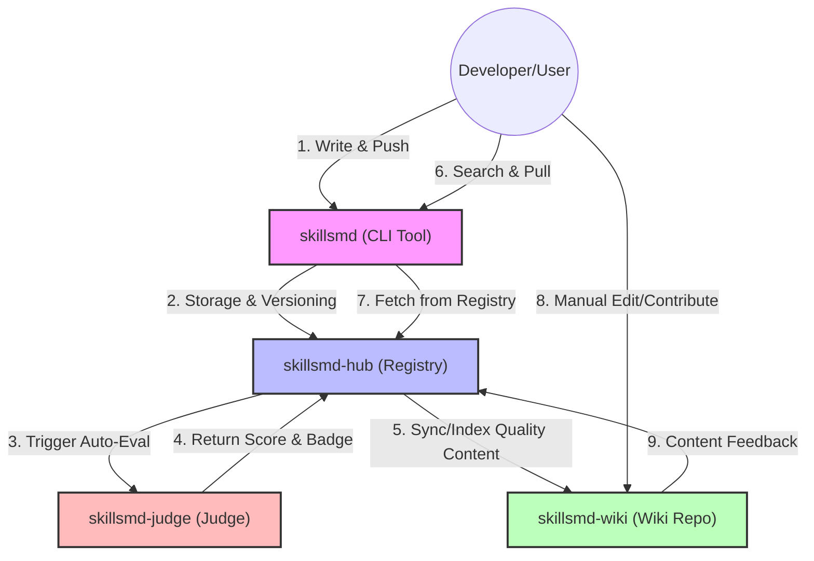

# OpenSkillsmd: Redefining the Evolution of AI Agents

[English](./README.md) | [简体中文](./README.zh.md) | [日本語](./README.ja.md) 

OpenSkillsmd is an open-source infrastructure for AI Agent skills. We serve a dual purpose: the **Docker Hub** for distribution and the **Wikipedia** for collective intelligence.

---

## 🌟 Our Vision

### 📦 Efficient Distribution (The Docker Hub)
Through the standardized `skill.md` protocol, we enable `pull` and `push` capabilities for Agent skills. Developers can instantly download official or community-certified skills to extend Agent capabilities seamlessly.

### 📖 Collaborative Knowledge (The Wikipedia)
Every `skill.md` is a distillation of intelligence. We encourage the community to iterate, cross-reference, and refine skill documents, making Agent instructions and tool definitions structured and transparent.

### 📊 Objective Evaluation (The Judge)
Driven by AI, our automated evaluation system scores public skills across multiple dimensions—instruction quality, stability, and adaptability. Only high-performing skills receive "Official Certification."

### 🚀 Slogan
> "Pull high-quality skills, Edit the future of Agents."

---

## 📂 Repository Architecture

| Repository | Role | Description | Vision |
| :--- | :--- | :--- | :--- |
| **`skillsmd`** | **CLI** | The binary tool for `pull`, `push`. | Productivity |
| **`skillsmd-hub`** | **Registry** | Core backend for versioning, API, and metadata. | Distribution |
| **`skillsmd-wiki`** | **Content** | Human-readable, categorized `skill.md` library. | Knowledge |
| **`skillsmd-judge`** | **Evaluator** | AI-powered scoring and certification engine. | Quality |

---

## 🔗 How it Works

